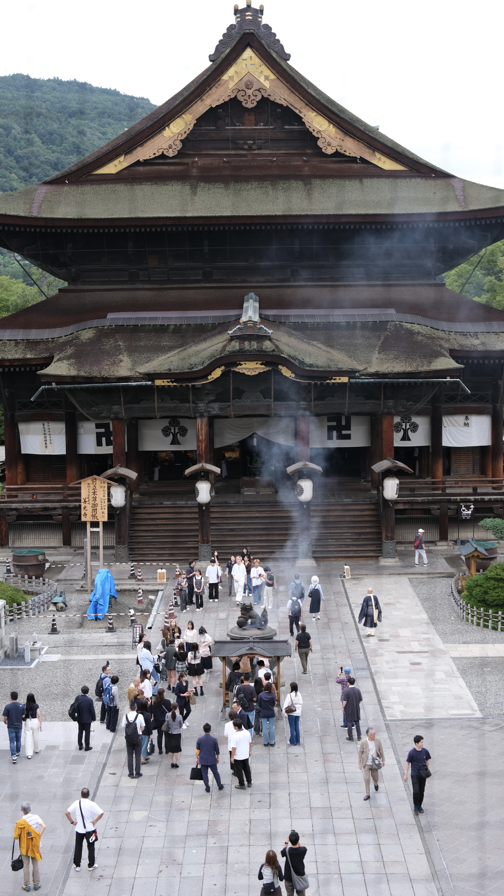
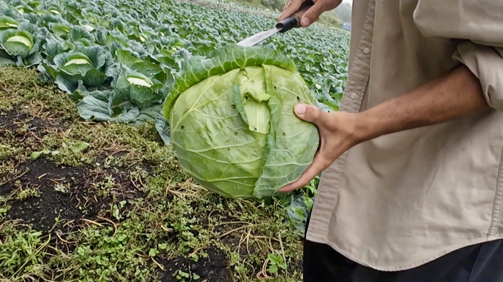
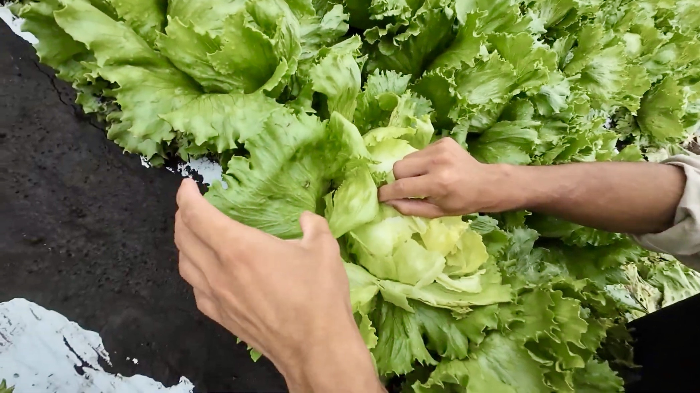
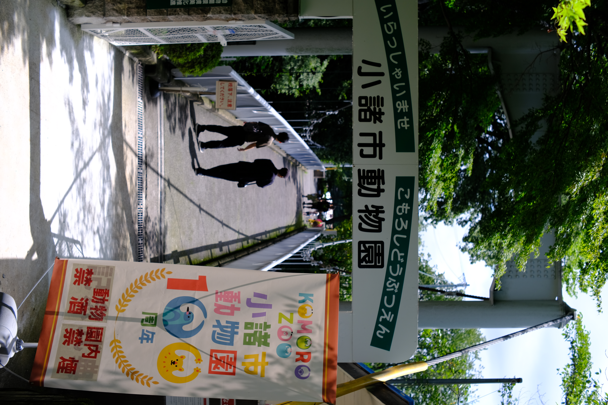
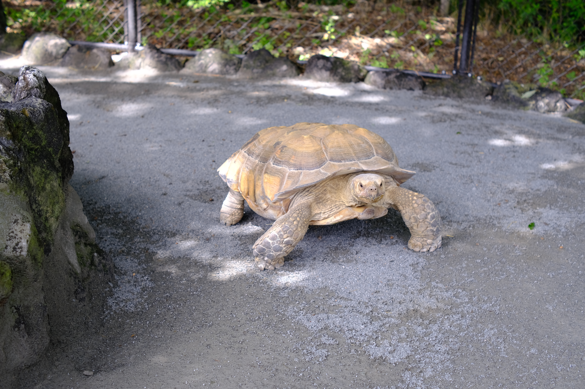
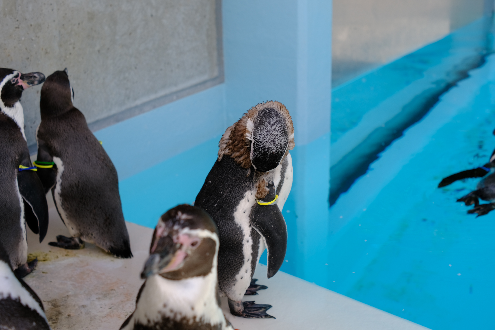
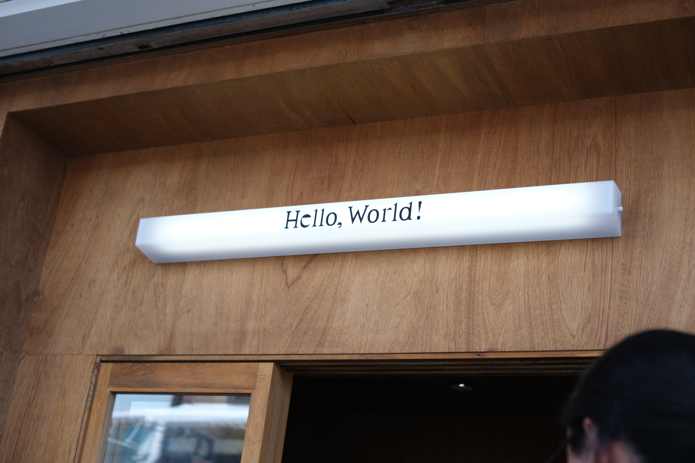

# 旅の写真

旅先で出会った景色や、ふと足を止めた瞬間を集めました。
写真を選ぶと、元のサイズで開きます。

<section class="gallery-trip" markdown="1">

2026.09.03 – 09.05 ／ 長野県 ／ 7枚

## 小諸散策

善光寺の境内から小諸の畑へ。動物園を歩いて、お茶とおやきでひと休み。

[旅行記を読む →](../Travel/260903_小諸散策.md){ .md-button }

<figure markdown="1">

[{ width=3462 height=6155 decoding=async }](../Travel/images/260903_小諸散策/260904_善光寺.jpg)

<figcaption markdown="1">
**善光寺**

本堂を望む。境内には参拝客とお香の煙。
</figcaption>
</figure>

<figure markdown="1">

[{ width=2096 height=1179 loading=lazy decoding=async }](../Travel/images/260903_小諸散策/260905_キャベツ.jpg)

<figcaption markdown="1">
**小諸の圃場 · キャベツ**

畑で見せてもらった、大きなキャベツ。
</figcaption>
</figure>

<figure markdown="1">

[{ width=2096 height=1179 loading=lazy decoding=async }](../Travel/images/260903_小諸散策/260905_レタスとタバコガ.jpg)

<figcaption markdown="1">
**小諸の圃場 · レタス**

葉を広げて、レタスを間近で観察。
</figcaption>
</figure>

<figure markdown="1">

[{ width=4160 height=6240 loading=lazy decoding=async }](../Travel/images/260903_小諸散策/260905_小諸市動物園.JPG)

<figcaption markdown="1">
**小諸市動物園 · 入口**

緑に囲まれた橋と、100周年ののぼり。
</figcaption>
</figure>

<figure markdown="1">

[{ width=6240 height=4160 loading=lazy decoding=async }](../Travel/images/260903_小諸散策/260904_小諸市動物園_亀.JPG)

<figcaption markdown="1">
**小諸市動物園 · カメ**

木漏れ日の下を歩くカメ。
</figcaption>
</figure>

<figure markdown="1">

[{ width=6240 height=4160 loading=lazy decoding=async }](../Travel/images/260903_小諸散策/260905_小諸市動物園_ペンギン.JPG)

<figcaption markdown="1">
**小諸市動物園 · ペンギン**

青いプールのそばに集まるペンギンたち。
</figcaption>
</figure>

<figure markdown="1">

[{ width=6240 height=4160 loading=lazy decoding=async }](../Travel/images/260903_小諸散策/260905_HelloWorld.JPG)

<figcaption markdown="1">
**Hello,World!**

日本茶とおやきでひと休みしたお店。
</figcaption>
</figure>

</section>
